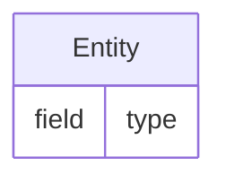

# GitHub Mermaid Rendering Fix

## Issue
GitHub was showing "Error rendering embedded code - No diagram type detected" for `.mmd` files because they contained markdown formatting.

## Problem
LinkML's `gen-erdiagram` outputs Mermaid diagrams wrapped in markdown code blocks:
```

```

## Solution
For `.mmd` files on GitHub, the content should be pure Mermaid syntax:
```
%% Title comment
erDiagram
  Entity {
    field type
  }
```

## Fix Applied to visualize_schema.py

### 1. Enhanced .mmd File Generation (`generate_erdiagram()`)
- Removes markdown code block markers (`\`\`\`mermaid` and `\`\`\``)
- Creates dual versions:
  - `.mmd` files with `%% Title` comments for GitHub
  - `.clean.mmd` files without comments for HTML processing

### 2. Improved HTML Generation (`create_html_viewer()`)
- Uses clean versions when available (`.clean.mmd` files)
- Enhanced filtering logic removes:
  - Mermaid comments (`%%`)
  - Markdown blocks (`\`\`\`mermaid`, `\`\`\``)
  - Empty lines and artifacts
- Robust fallback cleaning for existing files

### 3. Code-Level Protection
- Multiple layers of cleaning to handle various LinkML output formats
- Prevents syntax errors in both GitHub and HTML contexts

## Additional Issues Fixed
1. **Trailing markdown blocks** - Removed closing `\`\`\`` from .mmd files
2. **HTML syntax errors** - Removed Mermaid comments (`%%`) from HTML viewer
3. **File corruption** - Regenerated clean HTML viewer

## Result
- ✅ `.mmd` files now render properly on GitHub
- ✅ HTML viewer displays diagrams without syntax errors
- ✅ Files are compatible with VS Code Mermaid extensions
- ✅ Can be copied to mermaid.live for editing
- ✅ Both full schema and overview diagrams work correctly

## Commands
- `just visualize` - Generate clean Mermaid diagrams
- `just visualize-overview` - Generate without attributes
- `just analyze` - Schema analysis tools